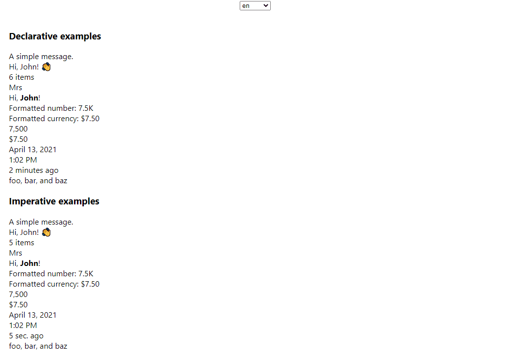

# React-Intl example

This project is a tutorial on how to do internationalization (i18n) in React projects with the `react-intl` library.

It contains examples for:

- Declarative usage of the `react-intl` library
- Imperative usage of the `react-intl` library

For more details check out the full article: [React-Intl tutorial](https://localizely.com/blog/react-intl-tutorial/)

## Requirements

- Node
- npm
- git

## Steps to get the app running

- `git clone`
- `cd react-intl-example`
- `npm install`
- `npm start`
